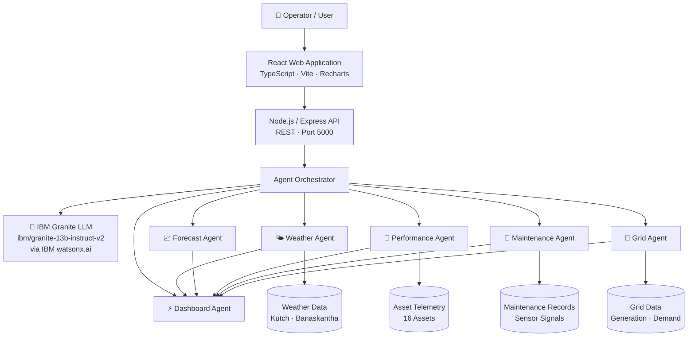

# 🌿 GreenPulse AI — Smart Renewable Energy Asset Intelligence Platform

> **Prototype** · All data is simulated for demonstration purposes · Not actual field measurements from Kutch or Banaskantha

[](https://www.ibm.com/watsonx)
[](https://react.dev)
[](https://typescriptlang.org)
[](https://nodejs.org)

---
> **Demo Preview :**  https://kyt47000.github.io/GreenPulse-AI/
---

## 🎯 Problem

Gujarat, India hosts some of the largest renewable energy installations in Asia, concentrated in regions such as **Kutch** and **Banaskantha**. These hybrid solar-wind installations face critical operational challenges:

- **Inconsistent maintenance scheduling** leading to unexpected equipment failures
- **Delayed anomaly detection** — underperforming assets discovered too late
- **Weather-related generation uncertainty** impacting grid stability
- **Equipment degradation** going undetected until failure
- **Grid integration challenges** — curtailment during generation peaks
- **No unified operational view** across solar farms, wind turbines, and hybrid sites

Without an intelligent operations platform, operators rely on manual inspection cycles and reactive maintenance — missing opportunities to prevent failures and optimize generation.

---

## 💡 Solution

GreenPulse AI is an **Agentic AI renewable energy operations platform** powered by IBM Granite LLM and a multi-agent architecture. It transforms raw operational data into explainable, actionable intelligence.

The platform answers eight critical operational questions:

1. How are my renewable assets performing right now?
2. Which assets are underperforming?
3. Which equipment may require maintenance soon?
4. How much solar/wind generation can we expect?
5. How will weather affect generation?
6. Are there potential grid-integration issues?
7. What action should the operator take?
8. Why is the AI recommending that action?

---

## 🤖 AI Agents

### Agent 1 — Asset Performance Monitoring Agent
Continuously analyzes telemetry from 16 renewable assets (solar farms, wind turbines, hybrid sites). Detects anomalies, calculates performance scores, identifies underperforming assets, and generates explanatory alerts.

**Example:** *"WT-07 is producing 18% below expected output under current wind conditions. Vibration is 37% above threshold — possible gearbox degradation."*

### Agent 2 — Predictive Maintenance Agent
Analyzes simulated sensor signals (vibration, temperature, RPM, operating hours) to predict equipment failures before they occur. Assigns health scores, failure risk levels (LOW/MEDIUM/HIGH/CRITICAL), and maintenance urgency.

**Example:** *"Solar Inverter INV-12 has a rising temperature trend combined with a 9% efficiency drop over 7 days. Inspection recommended within 72 hours."*

### Agent 3 — Generation Forecast Agent
Predicts solar and wind generation using weather conditions and historical patterns. Provides 6-hour, 24-hour, and 7-day forecasts with confidence ranges and weather impact analysis.

**Example:** *"Solar generation expected to decrease by 14% between 15:00–17:00 due to increased cloud coverage."*

### Agent 4 — Weather Intelligence Agent
Interprets regional weather data and quantifies its impact on renewable generation. Analyzes solar irradiance, cloud cover, wind speed, temperature, and humidity to produce actionable weather-generation impact reports.

### Agent 5 — Grid Optimization Agent
Evaluates grid integration decisions in real time. Analyzes generation vs. demand, available export capacity, storage options, and curtailment risk. Generates prioritized recommendations with confidence scores.

**Example:** *"High solar generation forecast will exceed grid export capacity by 45 MW between 11:30–14:30. Pre-charge storage by 11:00 and coordinate export to reduce curtailment by ~8%."*

### Dashboard / Orchestration Agent
Combines all agent outputs into a unified executive summary. Powers the AI Copilot chat interface where operators can ask natural-language questions and receive context-aware, data-grounded answers.

---

## 🏗 Architecture



---

## ✨ Features

### Platform Pages
| Page | Description |
|------|-------------|
| **Landing / Home** | Hero section, AI impact metrics, agent overview, demo scenarios |
| **Command Center** | Real-time KPIs, generation charts, grid balance, asset status |
| **Asset Monitoring** | All 16 assets with filtering by type, region, status, risk |
| **Asset Detail** | Individual asset telemetry, trend charts, AI diagnosis, maintenance info |
| **Predictive Maintenance** | Risk matrix, maintenance priority queue, health scores |
| **Generation Forecast** | 6h/24h/7d solar + wind forecasts, actual vs predicted |
| **Weather Intelligence** | Current conditions, trend charts, AI generation impact analysis |
| **Grid Optimization** | Energy flow diagram, balance charts, Scenario 2 demo |
| **AI Copilot** | IBM Granite chat interface with context-aware answers |
| **Agent Activity** | Animated multi-agent workflow timeline (WT-07 demo) |
| **Alert Center** | Centralized alerts with AI explanations, acknowledge/resolve |
| **Regional Map** | Schematic Gujarat asset map with status markers |
| **Architecture** | System design diagram and technology stack |

### Explainable AI
Every recommendation includes structured explanations:
- **WHAT** — What did the AI detect?
- **WHY** — What data caused the recommendation?
- **ACTION** — What should the operator do?
- **CONFIDENCE** — How confident is the AI (0–100%)?

---

## 🎬 Demo Scenarios

### Scenario 1 — WT-07 Performance Anomaly
1. Weather Agent analyzes wind conditions (8.4 m/s, NW)
2. Forecast Agent calculates expected turbine output (2.05 MW)
3. Performance Agent detects WT-07 actual output: 1.68 MW (18% deficit)
4. Maintenance Agent identifies vibration 37% above threshold, health score 61%
5. Failure risk escalated to HIGH (72%)
6. Grid Agent evaluates 0.37 MW generation deficit impact
7. Dashboard Agent generates priority: "Inspect WT-07 gearbox within 2–4 days"

**Run from:** Agent Activity page → "Run WT-07 Demo Scenario"

### Scenario 2 — High Solar Generation + Grid Constraint
- Solar peak forecast: 485 MW (exceeds 440 MW grid capacity)
- Grid Agent detects 45 MW curtailment risk at 11:30–14:30
- Recommendation: Pre-charge storage by 11:00, maximize export
- Expected benefit: Reduce curtailment by ~43 MW (8% of peak)

**Run from:** Grid Optimization page → "Apply AI Recommendation" toggle

---

## 🛠 Technology Stack

| Layer | Technology |
|-------|-----------|
| **AI / LLM** | IBM Granite 13B (`ibm/granite-13b-instruct-v2`) via IBM watsonx.ai |
| **AI Architecture** | Multi-agent orchestration, tool-based workflows, mock fallback |
| **Frontend** | React 18, TypeScript 5, Vite 5, React Router 6 |
| **Visualization** | Recharts (Area, Bar, Line, Scatter, Pie charts) |
| **Backend** | Node.js, Express 4, TypeScript |
| **State** | Zustand, local React state |
| **HTTP** | Axios, REST API |
| **Utilities** | date-fns, clsx |
| **Cloud** | IBM Cloud, IBM watsonx.ai, Code Engine (deployment target) |

---

## 🚀 Local Setup

### Prerequisites
- Node.js 18+ 
- npm 9+

### Install & Run

```bash
# Clone the repository
git clone <repository-url>
cd greenpulse-ai

# Install root dependencies
npm install

# Install frontend dependencies
npm install --prefix frontend

# Install backend dependencies
npm install --prefix backend

# Copy environment file
cp .env.example backend/.env
# Edit backend/.env with your IBM credentials (optional — mock mode works without them)

# Start frontend (port 3000)
npm run dev --prefix frontend

# In a second terminal — start backend (port 5000)
npm run dev --prefix backend
```

### Frontend only (no backend needed for demo)

```bash
cd frontend
npm install
npm run dev
# → http://localhost:3000
```

The frontend includes a full mock AI engine and works completely offline from the backend. All pages function with demo data.

---

## ⚙️ Environment Variables

Copy `.env.example` to `backend/.env`:

```env
# IBM Granite / watsonx.ai (optional — mock mode if not set)
IBM_API_KEY=your_ibm_api_key_here
IBM_PROJECT_ID=your_watsonx_project_id_here
IBM_URL=https://us-south.ml.cloud.ibm.com

# Server
PORT=5000
```

**Without IBM credentials:** The backend runs in mock mode. All AI responses are generated by the built-in GreenPulse mock engine. The UI remains fully functional.

**With IBM credentials:** The backend connects to IBM Granite 13B via watsonx.ai for enhanced, context-grounded AI responses.

> ⚠️ **Never commit `.env` to version control.** It is excluded by `.gitignore`.

---

## ☁️ IBM Cloud Deployment

### Option 1 — IBM Cloud Code Engine

```bash
# Build frontend production assets
npm run build --prefix frontend

# Build backend
npm run build --prefix backend

# Create Code Engine project
ibmcloud ce project create --name greenpulse-ai

# Deploy backend as Code Engine application
ibmcloud ce app create \
  --name greenpulse-backend \
  --image icr.io/your-namespace/greenpulse-backend:latest \
  --env IBM_API_KEY=$IBM_API_KEY \
  --env IBM_PROJECT_ID=$IBM_PROJECT_ID \
  --port 5000

# Deploy frontend (static) to IBM Cloud Object Storage + CDN
# or as a second Code Engine application serving the Vite build
```

### Option 2 — IBM Cloud Foundry

```bash
# Set environment variables in IBM Cloud dashboard
ibmcloud cf set-env greenpulse-ai IBM_API_KEY $IBM_API_KEY
ibmcloud cf set-env greenpulse-ai IBM_PROJECT_ID $IBM_PROJECT_ID
ibmcloud cf push greenpulse-ai
```

### GitHub Actions CI/CD (suggested)

```yaml
# .github/workflows/deploy.yml
on:
  push:
    branches: [main]
jobs:
  deploy:
    runs-on: ubuntu-latest
    steps:
      - uses: actions/checkout@v3
      - run: npm ci --prefix frontend && npm run build --prefix frontend
      - run: npm ci --prefix backend && npm run build --prefix backend
      # Add IBM Cloud CLI deployment steps
```

---

## 🔮 Future Scope

- **Real SCADA Integration** — Connect to actual plant control systems
- **IoT Sensor Streams** — Live vibration, temperature, RPM via MQTT/Kafka
- **Satellite Weather Data** — NASA POWER / ERA5 reanalysis for actual irradiance
- **Digital Twins** — Asset-level virtual models for predictive simulation
- **Battery Optimization** — Multi-objective storage dispatch optimization
- **Real-Time Grid APIs** — POSOCO / SLDC grid frequency and demand data
- **Federated Renewable Forecasting** — Cross-plant learning models
- **Mobile Operations App** — React Native field technician companion

---

## ⚠️ Disclaimer

This is a **prototype**. All data is simulated for demonstration purposes. Asset locations (Kutch, Banaskantha, Bhuj, Mundra, Deesa, Palanpur, Nakhatrana) are representative and not verified GPS field data. Generation figures, sensor readings, maintenance schedules, and impact estimates are synthetic. This application does not connect to currently any real power infrastructure or control systems.

---

## 📄 License

MIT © GreenPulse AI 

---

*Built with IBM Granite LLM · watsonx.ai · React · TypeScript · Node.js*
