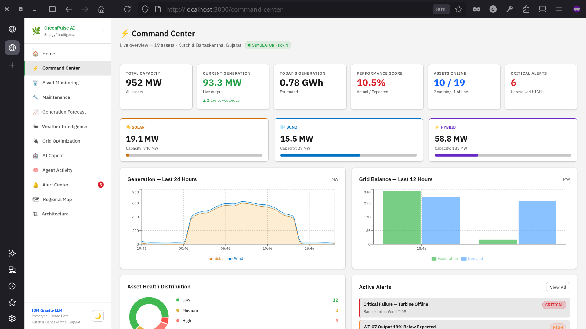
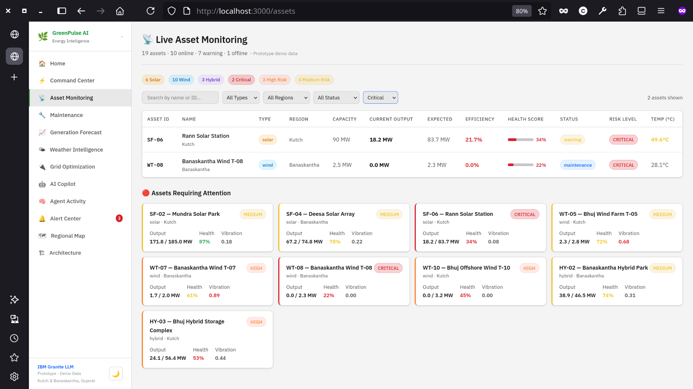
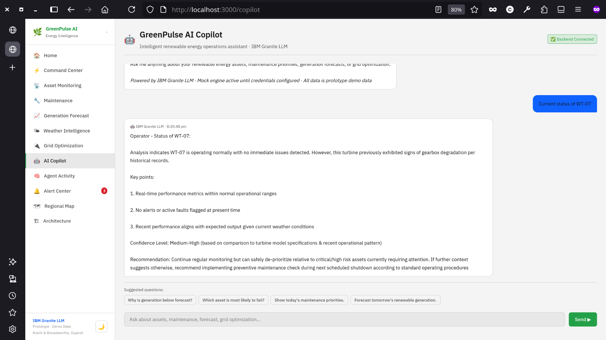
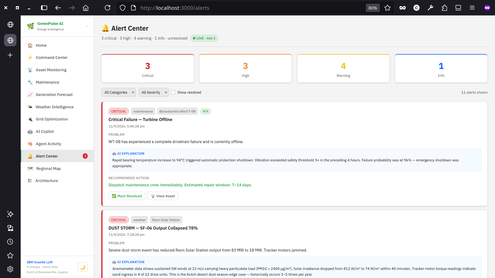
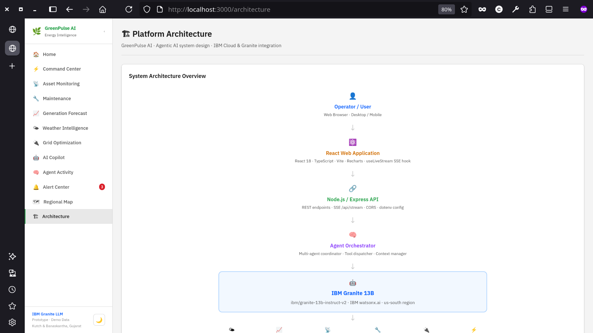

# 🌿 GreenPulse AI

### Renewable Energy Asset Intelligence Platform

> Agentic AI operations platform for solar-wind hybrid assets in Kutch & Banaskantha, Gujarat, India.
> Powered by **IBM Granite 13B LLM**, a multi-agent architecture, and a real-time SCADA simulator.

[](https://www.ibm.com/watsonx)
[](https://www.ibm.com/watsonx)
[](https://react.dev)
[](https://typescriptlang.org)
[](https://nodejs.org)
[](#license)

**Live Demo →** https://kyt47000.github.io/GreenPulse-AI/
_(Deployed on GitHub Pages — runs in **static mock mode**: all data is served from `demoData.ts`, no backend required)_

---

## Screenshots

### 1 — Command Center (Live Fleet Overview)


### 2 — Asset Monitoring & Detail


### 3 — AI Copilot (IBM Granite LLM)


### 4 — Alert Center (Real-Time Alerts)


### 5 — Platform Architecture Page


---

## Table of Contents

1. [Problem Statement](#problem-statement)
2. [Solution Overview](#solution-overview)
3. [System Architecture](#system-architecture)
4. [SCADA Simulator](#scada-simulator)
5. [Real-Time Frontend (SSE)](#real-time-frontend-sse)
6. [AI Agents](#ai-agents)
7. [Edge-Case Scenarios](#edge-case-scenarios)
8. [Technology Stack](#technology-stack)
9. [Local Setup](#local-setup)
10. [Environment Variables](#environment-variables)
11. [IBM Cloud Integration](#ibm-cloud-integration)
12. [Folder Structure](#folder-structure)
13. [Demo Scenarios](#demo-scenarios)
14. [Disclaimer](#disclaimer)

---

## Problem Statement

Gujarat, India hosts some of the largest renewable energy installations in Asia, concentrated in **Kutch** and **Banaskantha** districts. These hybrid solar-wind installations face critical operational challenges:

| Challenge | Impact |
|-----------|--------|
| Inconsistent maintenance scheduling | Unexpected equipment failures |
| Delayed anomaly detection | Underperforming assets discovered too late |
| Weather-related generation uncertainty | Grid instability during generation swings |
| Silent equipment degradation | Failures not detected until catastrophic |
| Grid integration peaks | Curtailment losses during maximum generation |
| No unified operational view | Fragmented visibility across 19 diverse assets |

---

## Solution Overview

GreenPulse AI is an **Agentic AI renewable energy operations platform** that transforms raw operational telemetry into explainable, actionable intelligence. It monitors 19 solar, wind, and hybrid assets in real time — detecting anomalies, predicting failures, forecasting generation, and optimizing grid integration — all driven by IBM Granite 13B LLM.

**Key design principle:** The platform is architecturally structured so the entire data pipeline — from sensor telemetry to AI recommendations — switches between a local SCADA simulator and IBM Cloud real-time infrastructure by changing **one environment variable**. Routes, agents, and the frontend are identical in both modes.

---

## System Architecture

```mermaid
flowchart TD
    U[👤 Operator] --> FE[React Frontend\nIBM Plex Sans · Dark/Light Theme\nSSE live stream via useLiveStream hook]

    FE -->|REST + SSE| API[Node.js / Express API]

    subgraph BACKEND["Backend — Data Source Adapter"]
        direction TB
        SW{DATA_SOURCE\nenv variable}
        SIM[🔄 SCADA Simulator\nbackend/src/data/simulator/\nTick every 3s · Gaussian drift\nEdge-case injection · SSE push]
        LIVE[☁️ IBM Cloud Live\nbackend/src/data/live/\nKafka consumer · Open-Meteo\nPostgreSQL time-series]
        SW -->|simulator| SIM
        SW -->|ibm-live| LIVE
    end

    API --> SW
    SW --> AGENTS[AI Agent Orchestrator]
    AGENTS --> GRANITE[IBM Granite 13B\nwatsonx.ai]

    style SIM fill:#1c2128,stroke:#3fb950
    style LIVE fill:#1c2128,stroke:#58a6ff
    style SW  fill:#1c2128,stroke:#e3b341
```



The **Data Source Adapter** (`backend/src/data/dataSourceAdapter.ts`) is the central architectural decision. All routes import exclusively from this adapter — never from `simulator/` or `live/` directly. Switching modes requires changing one line in `.env`. The routes, AI agents, SSE stream, and entire frontend are unchanged in both modes.

---

## SCADA Simulator

The simulator (`backend/src/data/simulator/scadaSimulator.ts`) runs a background tick every **3 seconds**, producing realistic sensor telemetry that mirrors what a real SCADA system delivers.

### Sensor Drift (per tick)

Each asset's telemetry is updated using Gaussian-like noise (`Math.random()` sums centered at 0):

| Signal | Drift Model |
|--------|-------------|
| Output MW (solar) | Follows sun-angle curve + ±noise |
| Output MW (wind) | Mean-reverting wind factor + ±noise |
| Temperature | ±0.3 °C per tick |
| Vibration | ±0.005 per tick (+ slow escalation on degraded assets) |
| RPM | ±0.2 per tick |
| Grid frequency | Mean-reverting to 50 Hz ± 0.02 Hz per tick |
| Operating hours | Increments in real time |

### Deterministic Scenario Escalation

Key assets follow scripted degradation curves independent of random noise:

| Asset | Escalation Pattern |
|-------|--------------------|
| **WT-07** | Vibration +0.0003/tick, RPM −0.01/tick, health −0.002/tick → gearbox failure trajectory |
| **HY-03** | Temperature +0.02 °C/tick → inverter approaching thermal limit |
| **WT-05** | Slow vibration increase → blade/pitch early warning |
| **WT-10** | Locked offline (SCADA comm loss); 0.1% chance/tick of reconnect |
| **WT-08** | Locked in `maintenance` state — drivetrain replacement in progress |
| **SF-06** | Low output (dust storm); very slow irradiance recovery |

### Edge-Case Injection

- **1% chance per tick** per eligible asset: random micro-spike (temperature surge or vibration burst)
- **High-wind over-speed event** injected at T+48–54h in generation forecast
- **3-hour blackout curtailment window** + frequency spike events in grid history

### SSE Push

On every tick, the updated `LiveState` is emitted to all connected SSE clients via `sseEmitter`. The frontend receives telemetry updates in under one second — no polling, no page refresh required.

---

## Real-Time Frontend (SSE)

The [`useLiveStream`](frontend/src/hooks/useLiveStream.ts) hook connects to `GET /api/stream` and keeps the entire UI in sync:

```ts
// frontend/src/hooks/useLiveStream.ts
const es = new EventSource(`${BASE_URL}/stream`);

// Immediate full snapshot on connect
es.addEventListener('snapshot', e => {
  const { assets, alerts, weather, grid, dataSource } = JSON.parse(e.data);
  setState(prev => ({ ...prev, assets, alerts, weather, grid, dataSource, connected: true }));
});

// Live updates every 3 s
es.addEventListener('tick', e => {
  const { assets, alerts, weather, grid } = JSON.parse(e.data);
  setState(prev => ({ ...prev, assets, alerts, weather, grid, tickCount: prev.tickCount + 1 }));
});

// Auto-reconnect on error with exponential back-off
es.onerror = () => {
  es.close();
  setTimeout(connect, 2_000);
};
```

**Pages consuming live stream:** Command Center and Alert Center display a `LiveBadge` indicator that shows `🟢 SIMULATOR · tick N` (or `☁️ IBM LIVE · tick N`) and updates on every tick. Both pages seed immediately from `demoData` so the UI is never blank while connecting.

---

## AI Agents

Six specialized agents collaborate in a multi-agent workflow, all powered by IBM Granite 13B LLM (with a deterministic mock fallback when `IBM_API_KEY` is not set):

| Agent | Operational Domain |
|-------|--------------------|
| **Weather Agent** | Regional analysis — temperature, irradiance, wind speed, dust index, extreme event detection |
| **Generation Forecast Agent** | Solar/wind prediction with edge-case models: dust storms, monsoon, high-wind cut-out |
| **Asset Performance Agent** | Monitors 19 assets — anomaly detection, comm loss, thermal derating, dust soiling |
| **Predictive Maintenance Agent** | Failure prediction: mechanical, thermal, electrical, and SCADA communication failure modes |
| **Grid Optimization Agent** | Export/storage/curtailment decisions — emergency blackout and frequency deviation response |
| **Dashboard Agent** | Orchestrates all agents — executive summaries, AI Copilot responses, prioritized operator recommendations |

### Explainable AI Structure

Every recommendation produced by the agent pipeline carries four structured fields:

- **WHAT** — What anomaly or condition did the AI detect?
- **WHY** — What data (sensor readings, thresholds, patterns) caused the recommendation?
- **ACTION** — What should the operator do, and within what timeframe?
- **CONFIDENCE** — How confident is the AI (0–100%)?

---

## Edge-Case Scenarios

All 6 scenarios are represented in live simulator data — visible across Asset Monitoring, Alert Center, Generation Forecast, and Grid Optimization pages.

| ID | Scenario | Affected Asset | Severity |
|----|----------|----------------|----------|
| EC-01 | Dust storm — panel irradiance collapse (−78%) | SF-06 Rann Solar | CRITICAL |
| EC-02 | Thermal runaway — battery inverter at 58.3 °C | HY-03 Bhuj Hybrid | CRITICAL |
| EC-03 | SCADA comm loss — turbine dark for 4 h 22 m | WT-10 Offshore Wind | HIGH |
| EC-04 | Grid blackout — 220 kV line fault, zero export | All assets | CRITICAL |
| EC-05 | High-wind over-speed — 9 turbine cut-out at T+48 h | WT-01 to WT-09 | HIGH |
| EC-06 | Monsoon surge — solar 85% below forecast for 3 days | All solar assets | HIGH |

---

## Technology Stack

| Layer | Technology |
|-------|------------|
| **AI / LLM** | IBM Granite 13B (`ibm/granite-13b-instruct-v2`) via IBM watsonx.ai |
| **AI Architecture** | Multi-agent orchestration, tool-based workflows, mock fallback |
| **Frontend** | React 18, TypeScript 5.2, Vite 5, React Router 6 |
| **Charts** | Recharts — Area, Bar, Line, Scatter, Pie |
| **Typography** | IBM Plex Sans + IBM Plex Mono |
| **Theming** | Dark / Light mode — system preference detection + localStorage |
| **Backend** | Node.js 20, Express 4, TypeScript |
| **Live Stream** | Server-Sent Events (SSE) — `GET /api/stream` |
| **Data Adapter** | `dataSourceAdapter.ts` — single switch point for simulator vs IBM Cloud |
| **Simulator** | SCADA simulator — 3 s tick, Gaussian sensor drift, edge-case injection |
| **HTTP Client** | Axios (REST polling fallback) |
| **Frontend Hosting** | GitHub Pages (static build via GitHub Actions) |

---

## Local Setup

### Prerequisites

- Node.js 18+
- npm 9+

### Install & Run — Full Stack

```bash
# 1. Clone the repository
git clone <repository-url>
cd greenpulse-ai

# 2. Install all dependencies
npm install
npm install --prefix frontend
npm install --prefix backend

# 3. Create backend environment file
cp .env.example backend/.env
# DATA_SOURCE=simulator is the default — works with no credentials

# 4. Start both frontend and backend
npm run dev
```

Or start them in separate terminals:

```bash
# Terminal 1 — Frontend (Vite dev server on http://localhost:3000)
npm run dev --prefix frontend

# Terminal 2 — Backend (Express on http://localhost:5000)
# SCADA Simulator starts automatically on startup
npm run dev --prefix backend
```

### Frontend Only — Static Mock Mode (GitHub Pages / no backend)

This is the mode the **live GitHub Pages demo** runs in. No backend, no credentials, no Node.js server needed.

```bash
cd frontend
npm install
npm run dev
# → http://localhost:3000
```

When `VITE_API_URL` is unset or the backend is unreachable, the frontend falls back to a fully self-contained static data layer:

| Layer | What powers it |
|-------|----------------|
| **Asset data** | `frontend/src/data/demoData.ts` — 19 pre-built assets (SF-01…SF-06, WT-01…WT-10, HY-01…HY-03) with realistic sensor values, health scores, and status flags |
| **Alerts** | 13 pre-built alerts with severity, AI explanation, and recommended action — all categories covered (performance, maintenance, weather, grid, forecast) |
| **Edge-case scenarios** | 6 scenarios fully embedded — dust storm, thermal runaway, SCADA comm loss, grid blackout, high-wind cut-out, monsoon surge |
| **Weather data** | `currentWeather` + `generateWeatherForecast()` in `demoData.ts` — Kutch region values (irradiance, wind, humidity, cloud cover) |
| **Generation history** | `generateHistoricalGeneration(days)` — procedurally generated 48-hour history with solar ramp curves and wind variance |
| **Generation forecast** | `generateGenerationForecast()` — 48-hour ahead forecast with high-wind cut-out event injected at T+48–54h |
| **Grid data** | `generateGridData()` — generation vs demand balance with curtailment window and frequency events |
| **Maintenance risk** | Derived from asset health scores and riskLevel in `demoData.ts` |
| **AI Copilot** | Built-in mock engine in `AICopilot.tsx` — keyword-matched responses for WT-07, maintenance priorities, generation forecast, grid optimization, failure risk. Source label shown as `GreenPulse Mock Engine (backend offline)` |
| **Live stream (SSE)** | `useLiveStream` hook attempts `GET /api/stream`. On failure it auto-reconnects silently — the UI seeds from `demoData.ts` and shows `Connecting…` in the LiveBadge until (or unless) a backend is available |

> **GitHub Pages note:** The deployed demo at `https://kyt47000.github.io/GreenPulse-AI/` has `VITE_API_URL` pointing to a backend URL in `frontend/.env.production`. If that backend is offline or not yet deployed, every page continues to work using the static mock layer above — the only visible difference is the `⚠️ Mock Mode` badge in AI Copilot and `Connecting…` in the Command Center LiveBadge.

### Verify Backend is Running

```bash
curl http://localhost:5000/api/health
# → { "status": "ok", "dataSource": "simulator", "ibmAI": "mock-mode", ... }

curl http://localhost:5000/api/assets
# → [ { "assetId": "SF-01", "currentOutputMW": 97.4, ... }, ... ]

# Watch the SSE stream live (Ctrl+C to stop)
curl -N http://localhost:5000/api/stream
```

---

## Environment Variables

Copy `.env.example` to `backend/.env` and configure:

```env
# ── Data Source ────────────────────────────────────────────────────────────────
# simulator  → SCADA simulator (default). Works offline, no credentials needed.
# ibm-live   → IBM Cloud Event Streams + Open-Meteo + PostgreSQL.
DATA_SOURCE=simulator

# ── IBM Granite / watsonx.ai ──────────────────────────────────────────────────
# Optional. If not set, backend runs in mock AI mode (deterministic responses).
# Get from: cloud.ibm.com → watsonx.ai → your project → Manage → API Keys
IBM_API_KEY=
IBM_PROJECT_ID=
IBM_URL=https://us-south.ml.cloud.ibm.com

# ── IBM Cloud Event Streams (Kafka) ───────────────────────────────────────────
# Required only when DATA_SOURCE=ibm-live
# Get from: IBM Cloud → Event Streams instance → Service credentials
EVENT_STREAMS_BROKER=
EVENT_STREAMS_API_KEY=

# ── IBM Cloud Databases (PostgreSQL) ──────────────────────────────────────────
# Required only when DATA_SOURCE=ibm-live
# Get from: IBM Cloud → Databases for PostgreSQL → Connection → JDBC URL
DATABASE_URL=

# ── Server ────────────────────────────────────────────────────────────────────
PORT=5000
NODE_ENV=development
```

---

## IBM Cloud Integration

GreenPulse AI is designed for zero-friction migration from the local SCADA simulator to full IBM Cloud infrastructure. The backend routes, AI agents, SSE stream, and entire frontend are unchanged in both modes.

### Step 1 — IBM Granite AI (free, no credit card)

**Service:** IBM watsonx.ai Lite tier — free

1. Create account at [cloud.ibm.com](https://cloud.ibm.com)
2. Open **watsonx.ai** → Create a project → copy **Project ID**
3. Navigate to **Manage → Access → API Keys** → Create key
4. Add to `backend/.env`:
   ```env
   IBM_API_KEY=your_api_key
   IBM_PROJECT_ID=your_project_id
   ```
5. Restart the backend — AI Copilot and all agent explanations switch from mock responses to real IBM Granite 13B instantly

---

### Step 2 — Real Weather Data (Open-Meteo, free, no key)

**Service:** [Open-Meteo API](https://open-meteo.com/) — completely free, no account required

Uncomment `fetchRealWeather()` in [`backend/src/data/live/ibmLiveSource.ts`](backend/src/data/live/ibmLiveSource.ts).
It calls the Open-Meteo REST API with Kutch coordinates (`lat=23.73, lon=69.86`) every 60 seconds.

---

### Step 3 — Backend Hosting (IBM Cloud Code Engine)

**Service:** IBM Cloud Code Engine — Pay-as-you-Go (free monthly allowance: 100,000 vCPU-seconds + 200,000 GB-seconds; scales to zero when idle)

```bash
# Install IBM Cloud CLI
curl -fsSL https://clis.cloud.ibm.com/install/linux | sh
ibmcloud login
ibmcloud plugin install code-engine

# Create project and deploy from source
ibmcloud ce project create --name greenpulse-ai

ibmcloud ce app create \
  --name greenpulse-backend \
  --build-source ./backend \
  --env DATA_SOURCE=simulator \
  --env IBM_API_KEY=$IBM_API_KEY \
  --env IBM_PROJECT_ID=$IBM_PROJECT_ID \
  --env IBM_URL=https://us-south.ml.cloud.ibm.com \
  --port 5000

# Retrieve deployed URL
ibmcloud ce app get --name greenpulse-backend --output url
```

Update `frontend/.env.production` with the Code Engine URL:
```env
VITE_API_URL=https://greenpulse-backend.<hash>.us-south.codeengine.appdomain.cloud/api
```

Rebuild and push to GitHub Pages — the SSE live stream now runs on IBM Cloud.

---

### Step 4 — Real-Time IoT Data (IBM Cloud Event Streams / Kafka)

**Service:** IBM Cloud Event Streams — Apache Kafka managed service

1. Set `DATA_SOURCE=ibm-live` in `backend/.env`
2. Uncomment the Kafka consumer in [`backend/src/data/live/ibmLiveSource.ts`](backend/src/data/live/ibmLiveSource.ts)
3. Install the Kafka client: `npm install kafkajs --prefix backend`
4. Add credentials to `backend/.env`:
   ```env
   DATA_SOURCE=ibm-live
   EVENT_STREAMS_BROKER=broker-0-xxxx.kafka.svc07.us-south.eventstreams.cloud.ibm.com:9093
   EVENT_STREAMS_API_KEY=your_api_key
   ```

**Required Kafka topics:**

| Topic | Payload |
|-------|---------|
| `greenpulse.asset-telemetry` | Per-asset sensor readings (vibration, temp, RPM, output MW) |
| `greenpulse.alerts` | Anomaly events from field SCADA systems |
| `greenpulse.weather` | Regional weather station data |
| `greenpulse.grid-status` | Grid frequency, demand, export capacity |

The Kafka consumer writes messages directly into `liveState` (the same in-memory object the simulator uses) and calls `sseEmitter.emit('tick', liveState)` — the SSE stream to the frontend is identical. No changes to routes or frontend are required.

---

### Step 5 — Time-Series Storage (IBM Cloud Databases for PostgreSQL)

**Service:** IBM Cloud Databases for PostgreSQL

Uncomment `getGenerationHistoryFromDB()` in [`backend/src/data/live/ibmLiveSource.ts`](backend/src/data/live/ibmLiveSource.ts) and wire it into `dataSourceAdapter.getGenerationHistory()`.

```sql
-- Schema (run once on your PostgreSQL instance)
CREATE TABLE asset_telemetry (
  id           BIGSERIAL PRIMARY KEY,
  asset_id     VARCHAR(10) NOT NULL,
  asset_type   VARCHAR(10) NOT NULL,
  recorded_at  TIMESTAMPTZ NOT NULL DEFAULT NOW(),
  output_mw    NUMERIC(8,2),
  expected_mw  NUMERIC(8,2),
  temperature  NUMERIC(5,1),
  vibration    NUMERIC(6,3),
  rpm          NUMERIC(6,1),
  health_score INT
);
CREATE INDEX ON asset_telemetry (asset_id, recorded_at DESC);
```

---

### Migration Summary

| Layer | Simulator Mode | IBM Cloud Live Mode |
|-------|----------------|---------------------|
| **Sensor telemetry** | `scadaSimulator.ts` (3 s tick) | IBM Event Streams Kafka consumer |
| **Weather** | Simulated drift in `liveAssetState.ts` | Open-Meteo REST API (real Kutch data) |
| **Generation history** | `generateHistoricalGeneration()` | IBM Cloud PostgreSQL time-series query |
| **AI responses** | Deterministic mock engine | IBM Granite 13B via watsonx.ai |
| **Frontend** | ✅ No change | ✅ No change |
| **Routes** | ✅ No change | ✅ No change |
| **SSE stream** | ✅ No change | ✅ No change |
| **LiveBadge indicator** | `🟢 SIMULATOR · tick N` | `☁️ IBM LIVE · tick N` |
| **Switch** | `DATA_SOURCE=simulator` | `DATA_SOURCE=ibm-live` |

---

## Folder Structure

```
GreenPulse AI/
│
├── .env.example                        ← Root env template — copy to backend/.env
├── .gitignore
├── package.json                        ← Root: concurrently runs frontend + backend
├── README.md
│
├── docs/
│   └── screenshots/                   
│       ├── 01-command-center.png
│       ├── 02-asset-monitoring.png
│       ├── 03-ai-copilot.png
│       ├── 04-alert-center.png
│       └── 05-architecture.png
│
├── frontend/
│   ├── index.html                      ← IBM Plex fonts · no-flash theme script
│   ├── vite.config.ts                  ← GitHub Pages base path (/GreenPulse-AI/)
│   ├── .env.production                 ← VITE_API_URL for deployed backend
│   └── src/
│       ├── main.tsx                    ← App entry — wrapped with ThemeProvider
│       ├── App.tsx                     ← React Router v6 route definitions
│       ├── index.css                   ← IBM Plex fonts · CSS variables · dark/light theme
│       │
│       ├── context/
│       │   └── ThemeContext.tsx        ← Dark/light theme provider + useTheme() hook
│       │
│       ├── hooks/
│       │   └── useLiveStream.ts        ← SSE hook → GET /api/stream · snapshot + tick events
│       │
│       ├── types/
│       │   └── index.ts                ← All TypeScript interfaces (Asset, Alert, Grid, etc.)
│       │
│       ├── data/
│       │   └── demoData.ts             ← 19 assets · 13 alerts · 6 edge-case scenarios
│       │                                  (frontend fallback when backend is unavailable)
│       ├── services/
│       │   └── api.ts                  ← Axios REST client (polling fallback)
│       │
│       ├── components/
│       │   └── layout/
│       │       ├── Sidebar.tsx         ← Navigation sidebar + ☀️/🌙 theme toggle
│       │       └── Layout.tsx          ← Shell layout wrapper
│       │
│       └── pages/
│           ├── Home.tsx                ← Landing page — live stats, agents, edge-case cards
│           ├── CommandCenter.tsx       ← Live KPIs, charts, asset table (SSE-powered)
│           ├── AssetMonitoring.tsx     ← 19-asset grid with filters and health indicators
│           ├── AssetDetail.tsx         ← Per-asset detail — sensors, history, risk
│           ├── AlertCenter.tsx         ← Real-time alerts, triage, ack/resolve (SSE-powered)
│           ├── PredictiveMaintenance.tsx ← Maintenance risk matrix, failure probability
│           ├── GenerationForecast.tsx  ← 48-hour solar/wind forecast with confidence bands
│           ├── WeatherIntelligence.tsx ← Regional weather, irradiance, wind analysis
│           ├── GridOptimization.tsx    ← Grid balance, curtailment, storage recommendations
│           ├── AICopilot.tsx           ← Chat interface → IBM Granite 13B
│           ├── AgentActivity.tsx       ← Agent timeline, WT-07 demo scenario runner
│           ├── RegionalMap.tsx         ← Asset locations across Kutch & Banaskantha
│           └── Architecture.tsx        ← System design, IBM Cloud services, data source switch
│
└── backend/
    ├── package.json
    ├── tsconfig.json
    ├── .env                            ← Your local env 
    └── src/
        ├── index.ts                    ← Express app entry — registers routes, starts data source
        │
        ├── data/
        │   ├── dataSourceAdapter.ts    ← ⭐ THE SWITCH — all routes import from here
        │   │                              Never import from simulator/ or live/ directly
        │   │
        │   ├── simulator/              ← SCADA simulator (DATA_SOURCE=simulator)
        │   │   ├── scadaSimulator.ts   ← 3 s tick engine · Gaussian drift · escalation · injection
        │   │   ├── liveAssetState.ts   ← Mutable in-memory LiveState (19 assets seeded at boot)
        │   │   └── sseEmitter.ts       ← Node EventEmitter bus: simulator → SSE route → clients
        │   │
        │   ├── live/                   ← IBM Cloud live data (DATA_SOURCE=ibm-live)
        │   │   └── ibmLiveSource.ts    ← Kafka consumer · Open-Meteo weather · PostgreSQL stubs
        │   │                              Uncomment implementations to go live
        │   └── mockData.ts             ← Static reference data (baseline for simulator seed)
        │
        ├── routes/
        │   ├── assets.ts               ← GET /api/assets, GET /api/assets/:id
        │   ├── weather.ts              ← GET /api/weather, GET /api/weather/current
        │   ├── generation.ts           ← GET /api/generation/history, /api/generation/forecast
        │   ├── grid.ts                 ← GET /api/grid
        │   ├── maintenance.ts          ← GET /api/maintenance
        │   ├── alerts.ts               ← GET /api/alerts
        │   ├── agents.ts               ← GET /api/agents
        │   ├── ai.ts                   ← POST /api/ai/chat
        │   └── stream.ts               ← GET /api/stream (SSE — snapshot + tick events)
        │
        ├── agents/
        │   └── dashboardAgent.ts       ← Agent orchestrator · IBM Granite + mock fallback
        │
        └── services/
            └── graniteService.ts       ← IBM watsonx.ai REST client · IAM token refresh
```

---

## Demo Scenarios

### Scenario 1 — WT-07 Gearbox Performance Anomaly

**Run from:** Agent Activity page → "Run WT-07 Demo Scenario"

| Step | Agent | Finding |
|------|-------|---------|
| 1 | Weather Agent | Wind 8.4 m/s at WT-07 location, irradiance 812 W/m² |
| 2 | Forecast Agent | Expected WT-07 output: 2.05 MW |
| 3 | Performance Agent | Actual output: 1.68 MW (−18%). Vibration: 0.89 (threshold: 0.65) |
| 4 | Maintenance Agent | Health score: 61%. Failure risk: 72% — HIGH. Mode: gearbox degradation |
| 5 | Grid Agent | 0.37 MW deficit — minor at fleet scale; curtailment risk assessed separately |
| 6 | Dashboard Agent | **Priority:** Gearbox inspection within 2–4 days before CRITICAL threshold |

> The simulator escalates WT-07 vibration by +0.0003 per tick. If left running, the health score continues falling toward CRITICAL within ~2 hours of uptime.

---

### Scenario 2 — High Solar Generation + Grid Export Constraint

**Run from:** Grid Optimization page → "Apply AI Recommendation" toggle

| Factor | Value |
|--------|-------|
| Solar peak forecast | 485 MW (exceeds 440 MW export capacity) |
| Curtailment risk window | 11:30–14:30 (45 MW excess) |
| AI recommendation | Pre-charge storage by 11:00, maximize coordinated export |
| Expected benefit | ~8% curtailment reduction |

---

## Disclaimer

This is a **prototype**. All sensor data is generated by the SCADA simulator (`backend/src/data/simulator/`). Asset locations in Kutch and Banaskantha are representative and not verified GPS field coordinates. Generation figures, vibration readings, temperature values, maintenance schedules, and impact estimates are entirely synthetic. This application does not connect to any real power infrastructure, control systems, or field SCADA equipment.

---

*Built with IBM Granite 13B LLM · IBM watsonx.ai · React 18 · TypeScript · Node.js · IBM Plex Sans*
